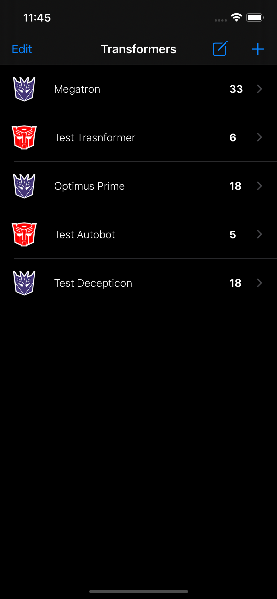
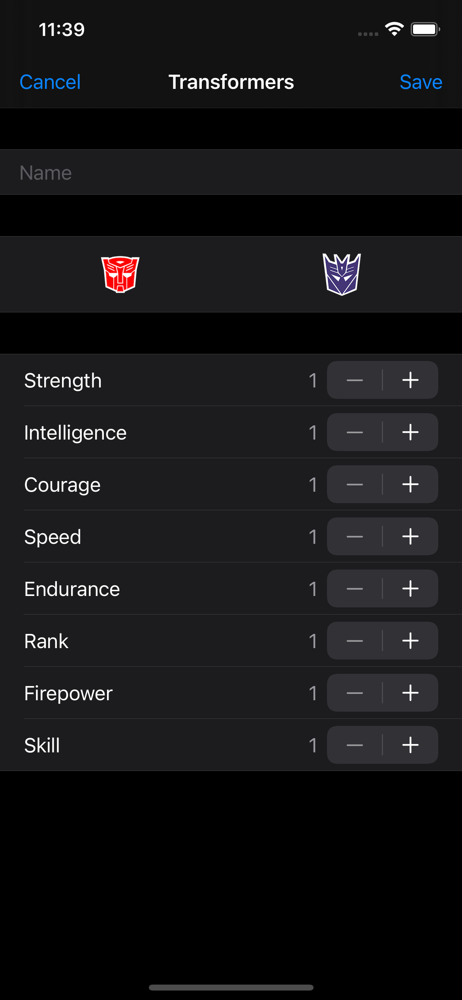
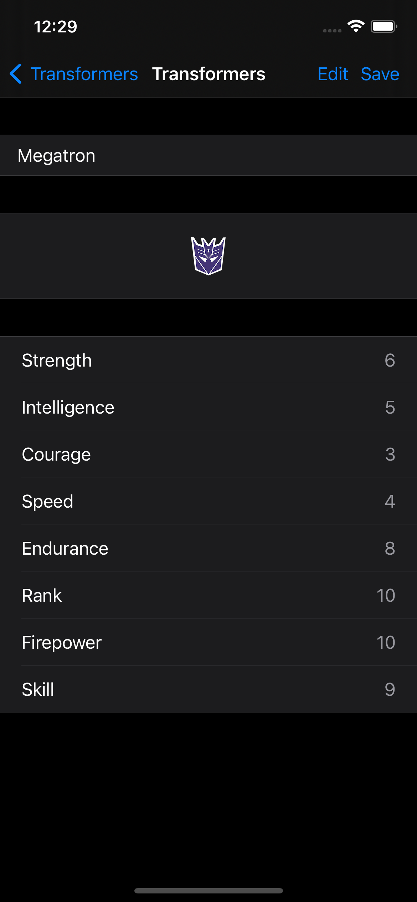

# Transformers App

Transformers app written in Swift 5 using the Transformers API.

## How to run

Clone the repository and run pod install. Open the workspace file and run the project.

## Screenshots

 

## Third-party libraries

### KeychainSwift (https://github.com/evgenyneu/keychain-swift)
Helper functions for saving text in Keychain securely for iOS, OS X, tvOS and watchOS.

## Contributing

Feel free to open an issue or submit a pull request if you have any improvement or feedback.

## Author

Alonso Alvarez, alonso.alvarez.dev@gmail.com
