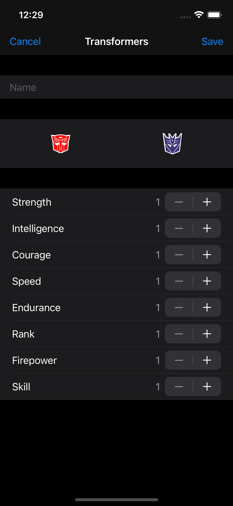
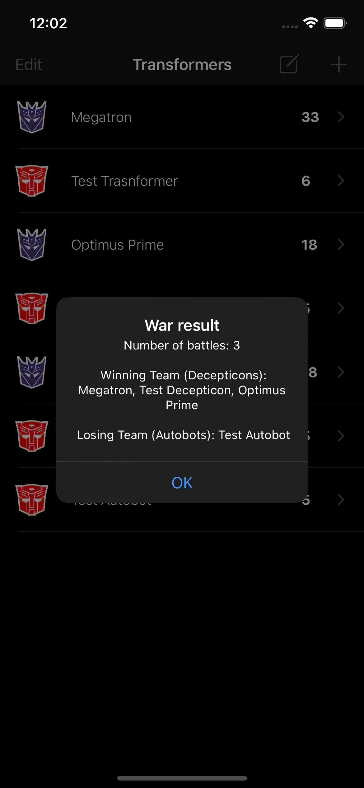

# Transformers App

Transformers app written in Swift 5 using the Transformers API.

## How to run

The app currently uses Cocoapods for dependencies managements.
You should clone the repository and go to the folder where the Podfile is located and then run pod install. 
Finally, open the workspace file and run the project with command + R or command + U if you want to run the unit tests.

## Screenshots

 

## Third-party libraries

### KeychainSwift (https://github.com/evgenyneu/keychain-swift)
Helper functions for saving text in Keychain securely for iOS, OS X, tvOS and watchOS.

## Contributing

Feel free to open an issue or submit a pull request if you have any improvement or feedback.

## Author

Alonso Alvarez, alonso.alvarez.dev@gmail.com
